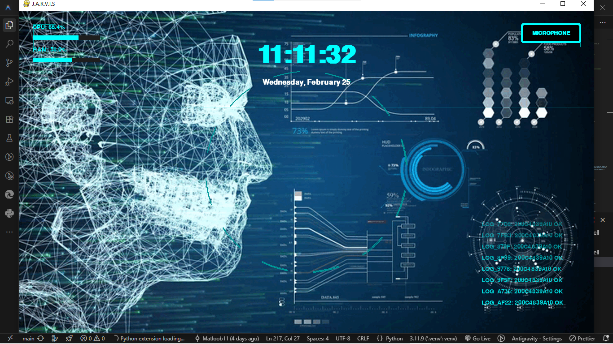

# 🔱 J.A.R.V.I.S Agent: Advanced Multimodal AI Assistant

> **The Elite Personal Assistant Ecosystem | Engineered by Sir Matloob**

---

<div align="center">
  
  <br>
  
  
  
  
</div>

---

## 🌌 Project Vision

J.A.R.V.I.S (Just A Rather Very Intelligent System) is not just a chatbot; it's a **Multimodal Live Assistant** designed for professional automation, deep reasoning, and personalized emotional intelligence. Built on the **Google Gemini 2.5 Flash Native Audio** model and **LiveKit** infrastructure, it offers real-time voice, vision, and tool-augmented intelligence.

---

## 🎨 Dual-Persona Interface Analysis

| **JARVIS Mode**                                    | **ANNA Mode**                                         |
| :------------------------------------------------- | :---------------------------------------------------- |
|                |                       |
| **Persona**: Professional, Elite, Loyal Assistant. | **Persona**: Affectionate, Romantic, Protective "GF". |
| **Voice**: Charon (Deep, Professional Male).       | **Voice**: Aoede (Soft, Warm Female).                 |
| **Language**: Roman Urdu / English Mirroring.      | **Language**: Caring Roman Urdu (Natural).            |
| **UI Aesthetics**: Blue Tech HUD / 3D Analysis.    | **UI Aesthetics**: Cosmic Heart / Circuit Soul.       |

---

## 🧠 Brain Structure & Intelligence

### 1. 🧬 Multimodal Core

- **Gemini 2.5 Flash**: Native audio processing for near-zero latency, recognizing emotional nuances in voice.
- **Autonomous Reasoning**: Uses a dedicated logic engine to plan multi-step workflows before execution.
- **Self-Healing Protocol**: Automatically detects tool failures and attempts to repair its own codebase.

### 2. 🗃️ Advanced Memory System

- **Vector Memory (ChromaDB)**: Long-term archival of conversations with semantic search retrieval.
- **Identity Manager**: Persistently remembers facts about "Sir Matloob" and his background.
- **Context Extraction**: Proactively saves important snippets (reminders, preferences) from live conversation.

---

## 🛠️ Elite Tool Arsenal

| Feature              | Description                                                                   |
| :------------------- | :---------------------------------------------------------------------------- |
| 🌍 **Global Search** | Real-time internet research via Google Search and Perplexity-style synthesis. |
| 💻 **Code Forge**    | Generates, runs, and debugs Python/CMD scripts on the fly.                    |
| 📱 **Automation**    | Full control over WhatsApp, Notepad, and System Windows.                      |
| ☁️ **Weather AI**    | Real-time weather analytics with location awareness.                          |
| 📁 **File Engine**   | Folder management, file creation, zipping, and image downloading.             |
| 📧 **Messenger**     | Sends real-time emails via SMTP with attachments.                             |
| 🎥 **Media Suite**   | YouTube downloading, Media playback, and CLIPBOARD monitoring.                |
| 🧹 **Diagnostics**   | Pre-flight system health checks to ensure 100% operational status.            |

---

## 🚀 Professional Setup (A to Z)

### 📋 Prerequisites

- **Python 3.10 or 3.11** (recommended).
- **LiveKit Cloud** account (for real-time audio/RTC).
- **Google AI Studio** API Key (Gemini Flash).
- **System Dependencies**: OS-level audio drivers (PyAudio).

### ⚙️ Installation

1. **Clone the Forge**:

   ```bash
   git clone https://github.com/Matloob11/JARVIS-AGENT.git
   cd JARVIS-AGENT
   ```

2. **Establish Environment**:

   ```bash
   python -m venv .venv
   source .venv/bin/activate  # Windows: .venv\Scripts\activate
   pip install -r requirements.txt
   ```

3. **Configure the Core**:
   Create a `.env` file from `.env.example`:
   ```env
   LIVEKIT_URL=wss://your-project.livekit.cloud
   LIVEKIT_API_KEY=your_key
   LIVEKIT_API_SECRET=your_secret
   GOOGLE_API_KEY=your_gemini_key
   WEATHER_API_KEY=your_openweather_key
   ```

### 🔱 Activation

Run the worker and the agent simultaneously:

```bash
python agent.py dev
```

_Wait for the "SYSTEM ONLINE" banner and the HUD to initialize._

---

## 🖼️ Visual Analytics (From `access/` Collection)

### [Technical Workspace](access/coding.png)

The heart of the development, showing the `agent_core.py` logic where tools and personas converge. Built with highly modular, object-oriented principles.

### [Visual HUD Architecture](access/jarvis_ui.png)

A breakdown of the Jarvis HUD, featuring real-time CPU/RAM metrics, system logging streams, and audio-reactive animations.

---

## 🛡️ Security & Integrity

- **Restricted Access**: Enforces wake-word protocols ("Jarvis" / "Anna").
- **Encrypted Local Storage**: Identity and memories are stored in structured JSON formats with atomic write protection.
- **Diagnostic Guard**: Automated monitoring for memory leaks or socket hangs.

---

<p align="center">
  <b>Designed with ❤️ for Sir Matloob</b><br>
  <i>"Excellence is not an act, but a habit."</i>
</p>
